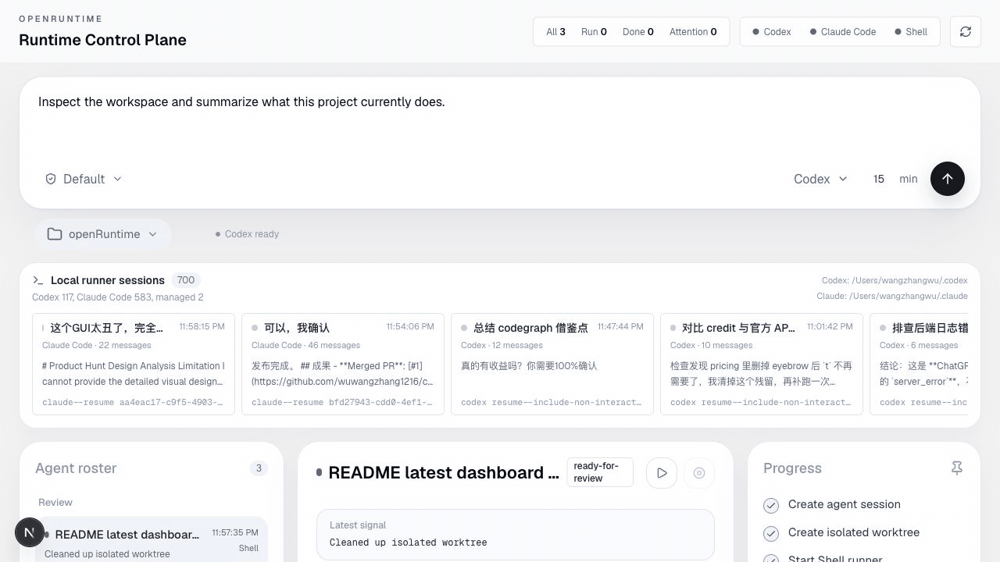
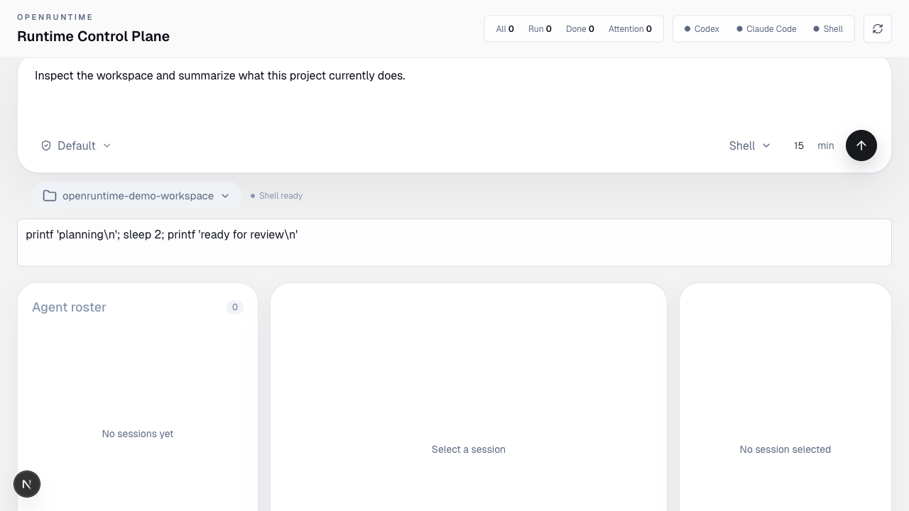
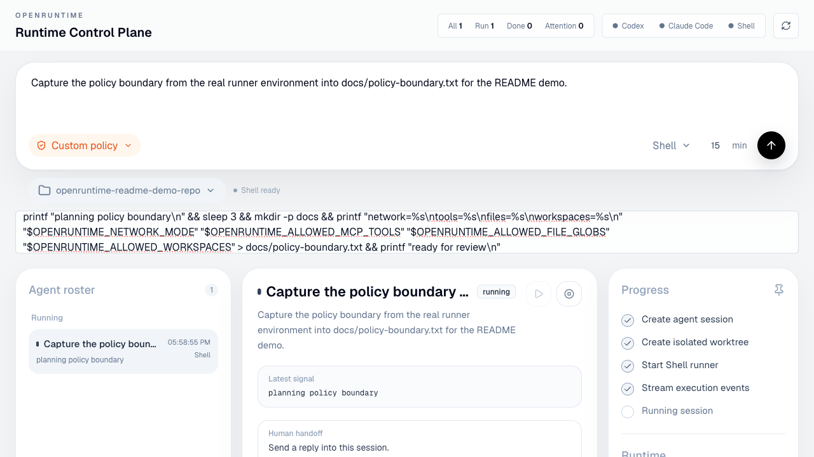
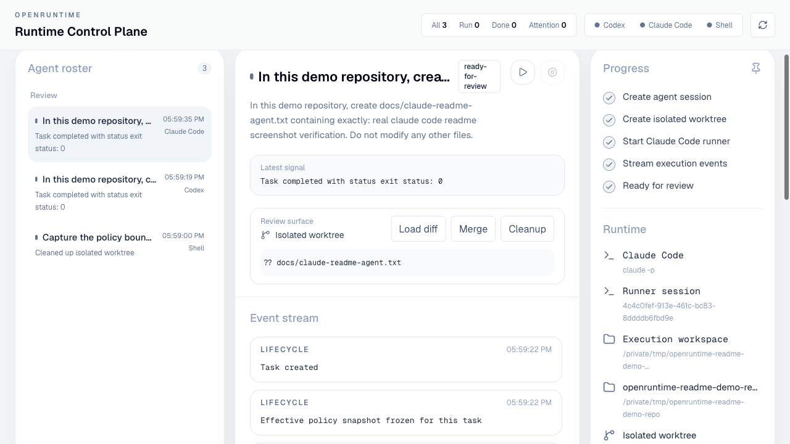
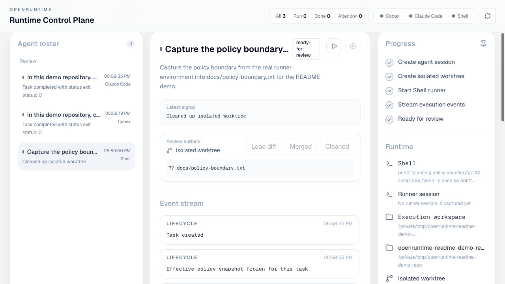
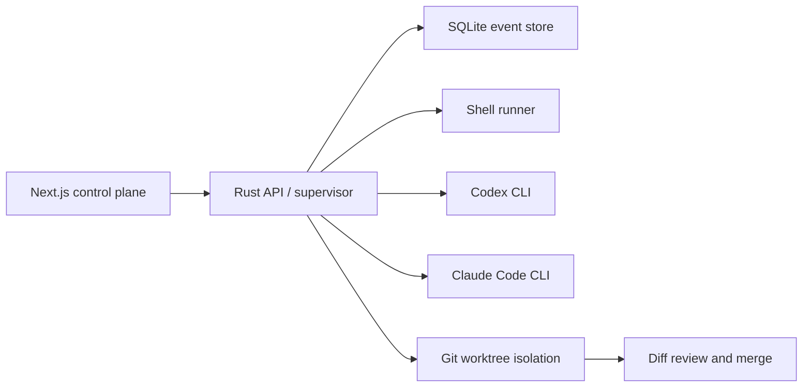

# openRuntime

openRuntime is a local-first control plane for running and supervising coding agents.
It gives Codex, Claude Code, and shell tasks a shared operating surface: task state,
runner availability, approval gates, isolated git worktrees, event history, and
diff-first review before changes are merged back.

The project is aimed at developers and teams who want the ergonomics of an agent
manager without handing their workspace, credentials, or execution environment to a
remote runtime.

## Why it exists

Modern coding agents are powerful, but the workflow around them is still rough:
multiple terminals, invisible process state, unclear permissions, scattered logs,
and risky file edits directly against the working tree. openRuntime treats each
agent run as an auditable session with explicit status, policy, output, and review
state.

The goal is not to replace Codex or Claude Code. The goal is to provide the
runtime layer around them.

## Demo



The demo above was captured from a real local run: a shell task was dispatched
from the GUI, isolated into a git worktree, allowed to modify a demo repository,
reviewed through the diff surface, merged back, and cleaned up.

| Dispatch and runner state | Live session timeline |
| --- | --- |
|  |  |

| Diff-first review | Merged and cleaned |
| --- | --- |
|  |  |

## What it does

- Runs tasks through `codex`, `claude`, or `/bin/sh`.
- Shows runner availability before dispatch.
- Tracks task lifecycle states: queued, running, needs input, ready for review,
  completed, failed, and stopped.
- Stores task metadata and event history in local SQLite.
- Captures lifecycle, stdout, stderr, input, diff, and error events.
- Tracks runner session ids and exposes attach/log surfaces for agent sessions.
- Supports runtime budgets so long-running sessions can be stopped.
- Applies local execution boundaries for workspace access, file/tool allowlists,
  network mode, secret redaction, approval requirements, and blocked command
  fragments.
- Freezes an effective policy snapshot when a task starts so execution and audit
  use the same boundary.
- Creates isolated git worktrees for repo-backed workspaces.
- Persists the exact execution workspace used by each task, including repo
  subdirectories inside isolated worktrees.
- Captures diff stats and patches for review.
- Supports approval, reply, stop, merge, and cleanup actions from the UI.
- Discovers, registers, and switches workspaces.
- Recovers persisted task history after backend restart.

## Architecture



openRuntime is intentionally local-first:

- The frontend runs in Next.js.
- The backend is a Rust Axum service.
- Process supervision runs on your machine.
- Session state is persisted to SQLite.
- Agent edits are isolated through git worktrees when the workspace is a git repo.

## Repository layout

```text
.
|-- backend/     # Rust Axum API, supervisor, policies, SQLite persistence
|-- frontend/    # Next.js control plane UI
|-- data/        # Local runtime database, ignored by git
`-- README.md
```

## Requirements

- Node.js 20+
- Rust stable
- Git
- Optional: Codex CLI installed and authenticated
- Optional: Claude Code CLI installed and authenticated

The app can still run shell tasks without Codex or Claude Code. Missing agent
runners are shown as unavailable in the UI.

## Quick start

Start the backend:

```bash
cd backend
cargo run
```

Start the frontend:

```bash
cd frontend
npm install
npm run dev
```

Open:

```text
http://localhost:3000
```

By default the frontend talks to:

```text
http://127.0.0.1:8080
```

Override it with:

```bash
NEXT_PUBLIC_API_URL=http://127.0.0.1:8080 npm run dev
```

## Configuration

SQLite defaults to:

```text
data/openruntime.sqlite3
```

Override it with:

```bash
OPENRUNTIME_DB=/absolute/path/to/openruntime.sqlite3 cargo run
```

For existing installs, the legacy `MANAGED_AGENTS_DB` environment variable is
still accepted as a fallback.

## Runner behavior

| Runner | Command shape | Notes |
| --- | --- | --- |
| Shell | `/bin/sh -lc <command>` | Keeps stdin open so replies can be sent into interactive shell sessions. |
| Codex | `codex exec --json --skip-git-repo-check -s workspace-write -C <workspace> <goal>` | Streams JSON events and runs against the selected execution workspace. Codex attach commands are shown when a session id is captured, but non-interactive resume replies are not exposed by the CLI yet. |
| Claude Code | `claude -p --output-format stream-json --session-id <task-id> <goal>` | Streams JSON events, records a stable session id, and can resume with `claude -p --resume <session-id> <reply>`. Requires the `claude` CLI to be available in `PATH`. |

When a selected workspace is a subdirectory of a git repository, openRuntime
creates a worktree at the repository root and persists the nested execution
workspace separately. Follow-up replies and resumed runner sessions use that
persisted execution workspace instead of falling back to the worktree root.

Reply behavior is runner-specific:

- Shell replies are written to the live process stdin.
- Claude Code replies start a resumed session process when no live child is
  attached.
- Codex currently exposes attach/log commands, but openRuntime does not attempt
  a non-interactive resume reply because the CLI does not provide one.
- If a live runner process cannot accept stdin, openRuntime records an error
  instead of spawning a second process over the same task.

## Agent workflow

1. Choose a workspace.
2. Select a runner: Codex, Claude Code, or Shell.
3. Set a goal, runtime budget, and permission preset.
4. Start the task.
5. Watch lifecycle and output events stream into the session timeline.
6. Reply, approve, stop, or inspect the session when needed.
7. Review captured diffs.
8. Merge useful worktree changes back into the target workspace.
9. Cleanup the isolated worktree.

## Guardrails

openRuntime currently includes local policy checks for:

- network-sensitive command fragments such as `curl`, `wget`, `ssh`, `scp`, and
  `nc`;
- git write operations such as commit, merge, rebase, checkout, reset, push, and
  stash;
- secret-sensitive command fragments and environment access;
- explicit human approval before task start;
- immutable effective policy snapshots at task start;
- workspace allowlists;
- file glob and MCP/tool allowlists passed into runner environments;
- network mode hints passed into runner environments;
- secret redaction for persisted runner output;
- per-task runtime and cost ledger fields;
- custom blocked command fragments per task.

These guardrails are a practical local execution boundary, not a full sandbox.
Treat local agent execution with the same care you would use for any tool that
can run commands in your workspace.

## API surface

The backend exposes a small local API:

| Endpoint | Purpose |
| --- | --- |
| `GET /health` | Health check |
| `GET /runners` | List runner availability |
| `GET /workspaces` | List known workspaces |
| `POST /workspaces/pick` | Pick a workspace through the local OS dialog |
| `POST /workspaces/register` | Register a workspace path |
| `GET /tasks` | List tasks with events |
| `POST /tasks` | Create a task |
| `GET /tasks/{id}` | Read one task |
| `GET /tasks/{id}/events` | Read task event history |
| `GET /tasks/{id}/runner/logs` | Read persisted runner output and session lifecycle events |
| `POST /tasks/{id}/runner/attach` | Get the terminal attach command for a captured runner session |
| `POST /tasks/{id}/start` | Start or restart a task |
| `POST /tasks/{id}/stop` | Stop a running task |
| `POST /tasks/{id}/approve` | Approve a gated task |
| `POST /tasks/{id}/reply` | Send input to a task |
| `GET /tasks/{id}/diff` | Read captured diff stat and patch |
| `POST /tasks/{id}/worktree/merge` | Merge reviewed worktree changes |
| `POST /tasks/{id}/worktree/cleanup` | Remove an isolated worktree |

## Development

Backend checks:

```bash
cd backend
cargo check
```

Frontend checks:

```bash
cd frontend
npm run lint
npm run build
```

## Project status

openRuntime is an early, working prototype. The current focus is the local
single-user control plane: real agent execution, worktree isolation, task
persistence, and review workflows.

Planned areas:

- stronger filesystem enforcement beyond local allowlists and runner env hints;
- richer MCP allowlists and per-tool scopes;
- real token and model-cost accounting from runner event streams;
- richer audit export;
- multi-user/team governance;
- remote runner support;
- versioned agent memory;
- outcome rubrics and automated quality checks.

## License

MIT License. See [LICENSE](LICENSE).
